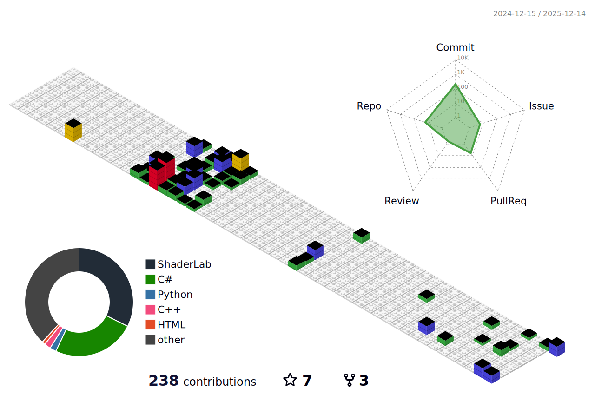

  

  

  

---

### **TECH STACK**

  

---

### **GITHUB STATISTICS**

  

---

### **TECHNICAL STATISTICS**

<!--START_SECTION:waka-->
<!--END_SECTION:waka-->

  

---

### **ACTIVITY GRAPH**

  

---

### **TROPHIES**

  

---
